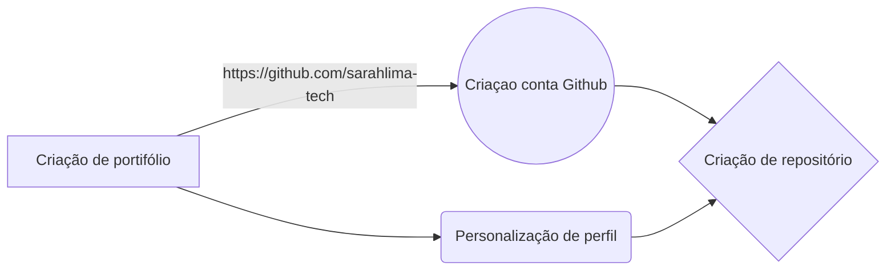

# Relatório de projeto - Github

Repositório criado no **Github.** O projeto será baseado no relatório da faculdade. 

## Processo de criação da conta Github

Criei uma conta no site da Github e pude observar alguns repositórios com minis projetos. A minha linguagem de foco de aprendizado inicial escolhida foi a **Python**, após algumas pesquisas cheguei a conclusão que é a mais fácil nesse meu primeiro contato. 

## Criação de repositórios

Gerei uma pasta pelo prompt de comando para fazer uma pasta no meu computador para guardar os projetos criados. Além do uso do Google Collab para a subir as programações. 

## Experiência com a plataforma - Github

É uma excelente ferramenta não só para iniciantes mas também para grandes empresas. Onde todos podem oferecer e receber serviços por meio de repositórios. 
Lá, são disponibilizadas ferramentas de pesquisa e o que eu achei mais interessante repositórios de grandes empresas como a **Microsoft** por exemplo. 

## Logistíca do processo de criação:

## Conclusão 
A Github é uma boa opção para quem trabalha com desenvolvimento de software, gerenciamento de projetos, ou para quem quer aprender programação. De fato, uma plataforma que usarei muito. Aqui onde estágio todos os colaboradores da área de TI também fazem o uso da plataforma. 
Espero poder ajudar também a comunidade com meus projetos que com o tempo desenvolverei. Segue a seguir o link para o meu Github ser avaliado:  [enter link description here](https://github.com/sarahlima-tech)